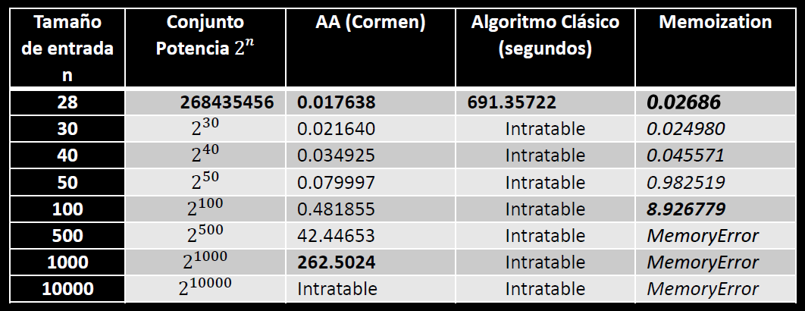
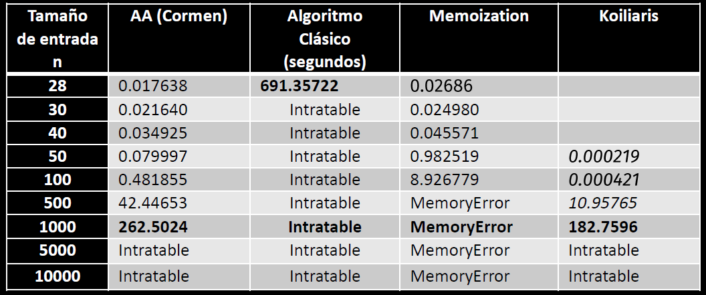

# Subset Sum Problem - Analisis for Aproximation Algorithms

 

## Structure
<pre>
	/src/- Python Source Code
	/slides.pdf
	/report.pdf
</pre>

## Results
Classic vs Basic Aproximation 
 
Memoization 
 

Koiliaris & Xu - Aproximation Algorithm 
Classic vs Basic Aproximation 
 

## Credits
https://github.com/saltycrane/subset-sum

## Downloads
- All: https://github.com/nextco/subset-sum/archive/master.zip
